# Contributing to Digmi Projects

Welcome to Digmi! We're excited to have you as part of our team. As our repositories are private, this guide is specifically for team members and authorized contributors.

## Table Of Contents

* [Getting Started](#getting-started)
* [Development Process](#development-process)
  * [1. Branching Strategy](#1-branching-strategy)
  * [2. Commit Messages](#2-commit-messages)
  * [3. Pull Request Process](#3-pull-request-process)
* [Code Standards](#code-standards)
* [Testing](#testing)
* [Documentation](#documentation)
* [Questions?](#questions)
* [References](#references)

## Getting Started

1. Make sure you have access to the necessary repositories
2. Set up your development environment according to the project's README
3. Familiarize yourself with our coding standards and practices

## Development Process

### 1. Branching Strategy

We follow [GitHub Flow][github-flow]:

* main - Protected branch containing production code
* Feature branches: feature/your-feature-name
* Bugfix branches: fix/issue-description

Releases are managed through tags instead of branches:

* 🏷️ Semantic versioning tags (e.g., v1.2.3) ([SemVer][semver])
* 📦 Each release gets a tag and GitHub release

### 2. Commit Messages

We use [Gitmoji][gitmoji] and [Conventional Commits][conventional-commits] for clear, expressive commit messages.

```mermaid
graph LR
    A[✨] --> B["[scope]"]
    B --> C[": "]
    C --> D["Message"]
    
    style A fill:#ffeb3b,stroke:#000
    style B fill:#e3f2fd,stroke:#000
    style C fill:#fff,stroke:#000
    style D fill:#e8f5e9,stroke:#000
```

Format: \<gitmoji> \[scope]: Message

Examples:

* ✨ \[android]: Add in-chair payment feature
* 🐛 \[ios]: Fix crash in booking flow
* 📝 \[docs]: Update API documentation
* ♻️ \[web]: Refactor campaign manager
* 🎨 \[tv]: Update salon view UI
* 🔖 \[release]: Bump version to v1.2.3

Common Gitmoji Usage:

* 🐛 (`:bug:`) - Fix a bug
* ✨ (`:sparkles:`) - New feature
* 📝 (`:memo:`) - Documentation
* ♻️ (`:recycle:`) - Refactoring
* 🎨 (`:art:`) - UI/Style
* ⚡️ (`:zap:`) - Performance
* 🔧 (`:wrench:`) - Configuration
* 🔒 (`:lock:`) - Security
* 💄 (`:lipstick:`) - Cosmetic
* ✅ (`:white_check_mark:`) - Tests
* 🔖 (`:bookmark:`) - Version tags

Guidelines:

1. Start with a gitmoji that best represents the change
2. Add scope in brackets for context
3. Write message in imperative form
4. Keep first line under 50 characters
5. Add detailed description if needed

### 3. Pull Request Process

1. Create a branch from main
2. Make your changes
3. Follow commit message guidelines
4. Submit a PR to main
5. Ensure CI/CD checks pass
6. Get at least one review approval

## Code Standards

* Follow the existing code style
* Write meaningful comments
* Include unit tests for new features
* Update documentation for API changes

## Testing

* Run local tests before pushing
* Ensure all CI/CD checks pass
* Test on both Android and iOS when applicable
* Verify TV app compatibility when relevant

## Documentation

* Update README files when needed
* Document API changes
* Include comments for complex logic
* Update configuration examples

## Questions?

Reach out to the team on Slack or through internal channels.

***

## References

* [Gitmoji][gitmoji] - Emoji guide for commit messages
* [Gitmoji Specification][gitmoji-spec] - Detailed gitmoji usage guide
* [Conventional Commits][conventional-commits] - Commit message specification
* [GitHub Flow][github-flow] - GitHub's lightweight branching workflow
* [Semantic Versioning][semver] - Version numbering standard

[gitmoji]: https://gitmoji.dev

[gitmoji-spec]: https://gitmoji.dev/specification

[conventional-commits]: https://www.conventionalcommits.org/en/v1.0.0/

[github-flow]: https://docs.github.com/en/get-started/quickstart/github-flow

[semver]: https://semver.org
